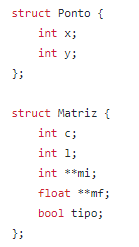
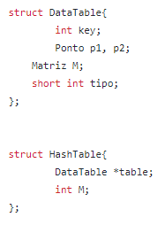
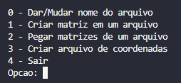
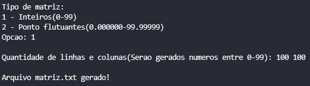
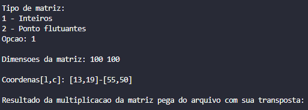
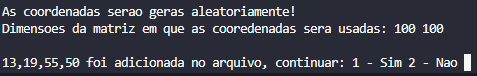

# Trabalhando com matrizes muito grandes em arquivos

 
 

Para este progama funcionar sem problemas os métodos de gerar matrizes devem ser utilizados, pois para ler o arquivo com a matriz ele tem que estar formatado. O arquivo coordenadas.txt não precisa ser gerado pelo progama, ele só precisa ter em cada linha quatro valores separados por vírgula

  Quando se está trabalhando com matrizes muito grands, com matrizes 10000x10000, um computador nomalmente não consiguira alaocar memória suficiente para poder trabalhar com está matriz, uma das formas de contornar este problema é colocar a matriz em um arquivo e pegar partes dela. Este código tem como objetivo fazer isto, além de quando a matriz for pega será feita a transposta dela e multiplicara as duas e mostra o resultado. A multiplicação de matrizes é algo que custa muito tempo, para contornar este problema será utilizada uma tabela hash que guardara os resultados da multiplições para caso precisa dela novamete será necessário apenas pegar ela da hash.

# A matriz

  A estrutura Matriz foi criada para representar uma matriz, nela há variáveis que guarda as dimensões da matriz, uma para guardar o tipo da matriz e duas outras que guardam as matrizes do determinado tipo da variável, logo se o tipo for true será armazenada em uma matriz de inteiros e se for false a matriz será uma matriz d pontos flutuantes, abaixo está uma foto da estrutura:   

  

# A hash

  A estrutura da hash foi baseada na seguinte: <a href="https://github.com/mpiress/HashTable">https://github.com/mpiress/HashTable</a> a sua diferença é que em de guardar um valor será guardado a estrutura Matriz, o tipo de matriz que foi inserida e as coordenadas que deram origem ao resultado da matriz. a imagem abaixo mostra a nova estrutura. Sobre as coordenadas para se criar a chave com elas, foi criado a aeguinte l[ogica (maiorColuna - menorColuna) MOD (maiorLinha - maiorColuna). 

  

#Execução do progama

  A primeira coisa que aparece quanto o código é iniciado mstra-se um menu, imagem abaixo), nele há 5 opções: 0 - Par dar/muar o nome do arquivo da matriz, 1 - Gerar a matriz no arquivo, 2 - Pegar as matrizes do arquivo, 3 - Para criar o arquivo de coordenadas e 4 - Para sair do progama. É obrigatório informar o nome do arquivo antes de criar o ler o arquivo. Quando for pedido as dimensões da matriz deve se informar a quantidade de linhas e a quantidade de colunas separados por espaço. A primeira coisa que deve ser feita ao iniciar o progama é criar o arquivo da matriz e das coordenas.   

  

 

  A opção 0 serve para setar ou trocar o nome do arquivo onde a matriz vai ser criarda ou está ela, a imagem abaixo apresenta está opção.

  

  A opção 1 pega o nome do arquivo setado na opção 0 e utiliza ele para criar o arquivo da matriz. Primeiro é perguntado qual tipo de matriz deve ser criada há duas opções: uma matriz de inteiros ou uma matriz de ponto flutuantes, após é pedido as dimensões da matriz que vai ser criada. A imagem abaixo ilustra está opção.

  

  A opção 2 pega o nome do arquivo setado na opção 0 e utiliza ele para abrir arquivo da matriz. Primeiro é perguntado qual o tipo da matriz dentro do arquivo há duas opções: uma matriz de inteiros ou uma matriz de ponto flutuantes, depois é pedido as dimensões da matriz que vai ser criada. Com estas informações as coordenadas das sub-matrizes são pegas do arquivo coordenadas.txt. Primeiro verifica se já tem o resultado na hash se houver só mostra ele, senão a sub-matriz é lida do arquivo, é feito a multiplicação dela com sua transposta e por último este resultado é guardado na hash. Depois é perguntado se o usuário quer pegar outra coordenada do arquivo de coordenadas. As imagem abaixo ilustram está opção.

  
  

  A opção 3 é utilizada para criar o arquivo coordenadas.txt, onde cada linha vai ter quatro valores separados por vírgula: o primeiro valor tem que ser menor ou igual ao terceiro e o segundo valor menor ou igual ao quarto. Estes valores são utilizados para falar as delimitações da sub-matriz que vai ser pega. Primeiro coisa que vai ser perguntada é qual as dimensões da matriz, após isto uma linha será gerada aleatoriamente e será perguntado se o usuário gostaria de adiconar ountra linha. A imagem abaixo mostra esá opção  

  

# Compilação e Execução

O progama disponibilizado possui um arquivo Makefile que realiza todo o procedimento de compilação e execução. Para tanto, temos as seguintes diretrizes de execução:

| Comando                |  Função                                                                                           |                     
| -----------------------| ------------------------------------------------------------------------------------------------- |
|  `make clean`          | Apaga a última compilação realizada contida na pasta build                                        |
|  `make`                | Executa a compilação do programa utilizando o gcc, e o resultado vai para a pasta build           |
|  `make run`            | Executa o programa da pasta build após a realização da compilação                                 |
